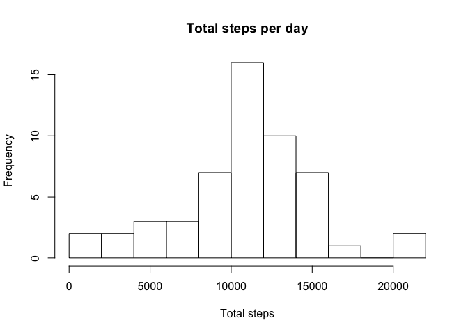
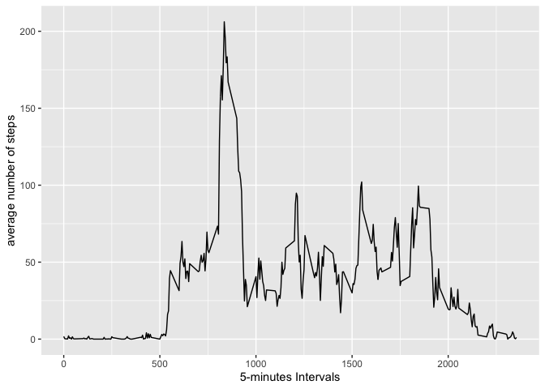
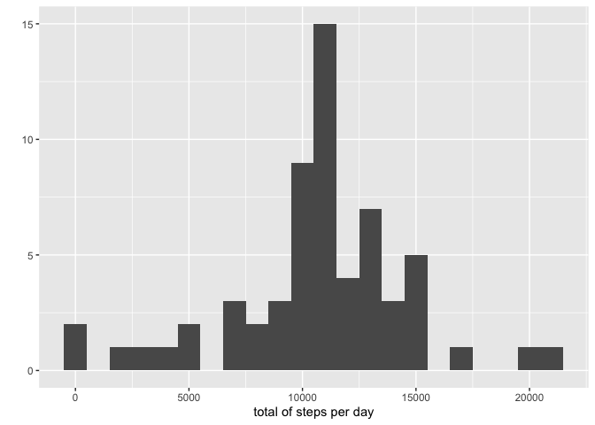
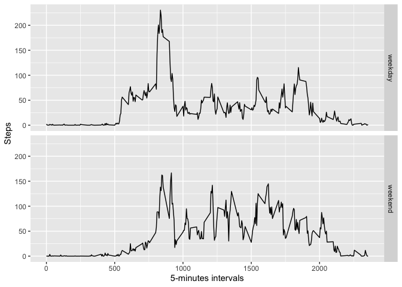

## Loading the libraries

```r
library(dplyr)
library(ggplot2)
```
## Loading and preprocessing the data

```r
x <- read.csv('/Users/admin/Desktop/Data Science/Data Science specialization/Reproducible research/RepData_PeerAssessment1/activity.csv')
head(x)
```

```
##   steps       date interval
## 1    NA 2012-10-01        0
## 2    NA 2012-10-01        5
## 3    NA 2012-10-01       10
## 4    NA 2012-10-01       15
## 5    NA 2012-10-01       20
## 6    NA 2012-10-01       25
```

```r
str(x)
```

```
## 'data.frame':	17568 obs. of  3 variables:
##  $ steps   : int  NA NA NA NA NA NA NA NA NA NA ...
##  $ date    : Factor w/ 61 levels "2012-10-01","2012-10-02",..: 1 1 1 1 1 1 1 1 1 1 ...
##  $ interval: int  0 5 10 15 20 25 30 35 40 45 ...
```

```r
x$day <- weekdays(as.Date(x$date))
x$DateTime <- as.POSIXct(x$date, format="%Y-%m-%d")
y <- x[!is.na(x$steps),] # data without NA's
```

## What is mean total number of steps taken per day?

```r
sum_by_date <- aggregate(x$steps ~ x$date, FUN = sum) # Creating a table of total steps grouped by days
hist(sum_by_date$'x$steps', breaks = 8, xlab = 'Total steps', main = 'Total steps per day') # Building the histogram
```

<!-- -->

```r
mean(sum_by_date$'x$steps') # The mean of steps per day
```

```
## [1] 10766.19
```

```r
median(sum_by_date$'x$steps') # The median of steps per day
```

```
## [1] 10765
```

## What is the average daily activity pattern?

```r
average_steps <- aggregate(x=list(steps=x$steps), by=list(interval=x$interval),
                      FUN=mean, na.rm=TRUE)
ggplot(data=average_steps, aes(x=interval, y=steps)) +
    geom_line() +
    xlab("5-minutes Intervals") +
    ylab("average number of steps")
```

<!-- -->

```r
average_steps[which.max(average_steps$steps),] # the max number of steps
```

```
##     interval    steps
## 104      835 206.1698
```

## Imputing missing values

```r
# Calculating the number of NA's
NAs <- is.na(x$steps)
table(NAs)
```

```
## NAs
## FALSE  TRUE 
## 15264  2304
```

```r
# NA's are replaced with interval's mean
filled.missing <- function(steps, interval) {
    filled <- NA
    if (!is.na(steps))
        filled <- c(steps)
    else
        filled <- (average_steps[average_steps$interval==interval, "steps"])
    return(filled)
}
filled.data <- x
filled.data$steps <- mapply(filled.missing, filled.data$steps, filled.data$interval)
```


```r
total.steps <- tapply(filled.data$steps, filled.data$date, FUN=sum)
qplot(total.steps, binwidth=1000, xlab="total of steps per day")
```

<!-- -->


```r
mean(total.steps)
```

```
## [1] 10766.19
```

```r
median(total.steps)
```

```
## [1] 10766.19
```

## Are there differences in activity patterns between weekdays and weekends?

```r
day_of_week <- function(date) {
    day <- weekdays(date)
    if (day %in% c("понеділок", "вівторок", "середа", "четвер", "п'ятниця"))
        return("weekday")
    else if (day %in% c("субота", "неділя"))
        return("weekend")
    else
        stop("invalid date")
}
# Days of weeks were written in Ukrainian, because it's the language of the system
filled.data$date <- as.Date(filled.data$date)
filled.data$day <- sapply(filled.data$date, FUN=day_of_week)
```


```r
average_steps <- aggregate(steps ~ interval + day, data=filled.data, mean)
ggplot(average_steps, aes(interval, steps)) + geom_line() + facet_grid(day ~ .) +
    xlab("5-minutes intervals") + ylab("Steps")
```

<!-- -->
